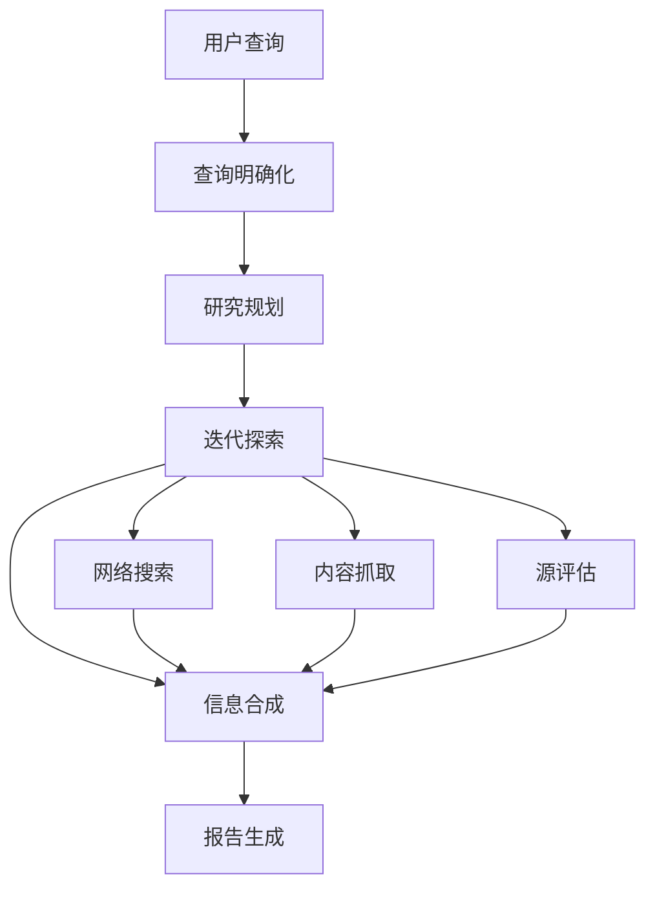

# Shandu：综合知识合成的高级AI研究系统

Shandu是一个尖端的AI研究助手，它使用先进的语言模型、智能网页抓取和迭代探索，对任何主题进行深入的多源研究，生成全面、结构良好且带有适当引用的报告。

[](LICENSE)
[](https://www.python.org/downloads/)

## 🔍 什么是Shandu？

Shandu是一个智能的、基于LLM的研究系统，它可以自动化完成综合研究过程——从初始查询明确到深入内容分析和报告生成。基于LangGraph的状态工作流，它通过复杂的算法递归探索主题，进行源评估、内容提取和知识合成。

### 主要应用场景

- **学术研究**：生成文献综述、背景信息和复杂主题分析
- **市场情报**：分析行业趋势、竞争策略和市场机会
- **内容创作**：制作有适当引用的研究文章、博客文章和报告
- **技术探索**：追踪新兴技术、创新和技术发展
- **政策分析**：研究法规、合规要求和政策影响
- **竞争分析**：跨行业比较产品、服务和公司策略

## ⚙️ 系统架构



## 🌟 核心特性

- **智能状态工作流**：利用LangGraph实现结构化、逐步的研究过程和清晰的状态转换
- **迭代深度探索**：通过动态深度和广度递归探索主题，适应发现的信息
- **多源信息合成**：分析来自搜索引擎、网页内容和结构化知识库的数据
- **增强型网页抓取**：具备动态JS渲染、内容提取和道德抓取实践
- **智能源评估**：自动评估源的可信度、相关性和信息价值
- **内容分析管道**：使用高级NLP提取关键信息、识别模式和合成发现
- **综合报告生成**：创建详细、结构良好的报告，包含适当引用和主题组织
- **并行处理架构**：实现并发操作以提高多查询执行效率
- **自适应搜索策略**：基于发现的信息和知识空白动态调整搜索查询
- **完整引用管理**：以多种样式正确引用所有来源

## 🚀 安装与配置

### 环境要求
- Python 3.9+
- Ollama 服务（用于本地模型）
- 必要的Python包：
  - streamlit
  - requests
  - beautifulsoup4
  - urllib3
  - langchain
  - langgraph

### 安装步骤

```bash
# 从源代码安装
git clone https://github.com/jolovicdev/shandu.git
cd shandu
pip install -e .
```

## 🏁 快速开始

### 基础使用

```bash
# 启动Streamlit应用
streamlit run app.py

# 确保Ollama服务运行（如果使用本地模型）
ollama serve
```

### 研究工具使用流程

1. 打开研究工具页面
2. 选择合适的模型
3. 输入研究主题
4. 等待自动搜索和分析
5. 查看研究结果

## 📊 技术能力

- **动态JS渲染**：处理JavaScript密集型网站
- **内容提取**：识别和提取网页主要内容
- **并行处理**：搜索和抓取的并发执行
- **缓存**：高效缓存搜索结果和抓取内容
- **速率限制**：尊重网络资源访问
- **Robots.txt遵从**：道德网页抓取实践
- **灵活输出格式**：Markdown、JSON、纯文本

## 📜 许可证和信息
本项目采用MIT许可证 - 详见[LICENSE](LICENSE)文件。

## 🤝 贡献
欢迎提交Issue和Pull Request来帮助改进项目。
```

